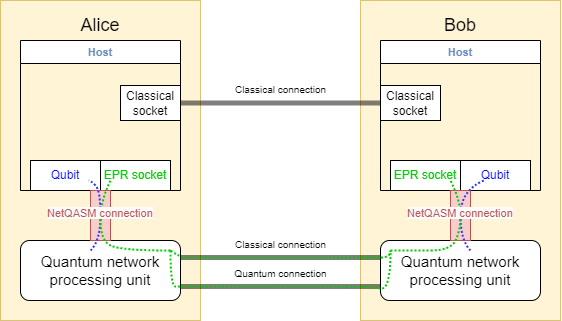

.. _label_tutorial_basics:

************************
Basics
************************
In this section you will be introduced to the basics of sending and receiving both classical and quantum information.
As well as the first steps of writing programs and manipulating Qubits.

This chapter of the tutorial takes the user through the example ``tutorial_examples\1_Basics``.
This chapter will focus only on ``application.py`` file.

The examples of this and the following sections contain the code snippets that are used in this tutorial.
As such the examples may provide support in understanding the context of each of the snippets.
Additionally all examples are fully functional.
In order to run an example, one must first make the current example directory the active directory:

.. code-block:: bash

   cd tutorial_examples\1_Basics

Afterwards one may run the simulation using:

.. code-block:: bash

   python3 run_simulation.py

Program basics
==============
In this section we will explain the basics of writing an application for SquidASM.
In the examples of this tutorial the ``application.py`` file will contain the programs that run on each node.
We define a separate meanings to program and application.
A program is the code running on a single node.
An application is the complete set of programs to achieve a specific purpose.
For example BQC is an application, but it consists of two programs, one program for the client and another for the server.

In this tutorial we will be creating a ``AliceProgram`` and a ``BobProgram`` that will run on a Alice and Bob node respectively.
Both the Alice and Bob program start with an unpacking of a ``ProgramContex`` object into ``csocket`` (a classical socket), ``epr_socket`` and ``connection`` (a NetQASM connection).

.. code-block:: python
   :caption: Alice

   class AliceProgram(Program):
       PEER_NAME = "Bob"

       def run(self, context: ProgramContext):
           # get classical socket to peer
           csocket = context.csockets[self.PEER_NAME]
           # get EPR socket to peer
           epr_socket = context.epr_sockets[self.PEER_NAME]
           # get connection to quantum network processing unit
           connection = context.connection

In order to understand the role of each of these objects, it is important to distinguish that the program will run on the host.
The host can be any type of classical computer.
The host is connected to a quantum network processing unit(QNPU),
that is responsible for local qubit operations and EPR pair generation with remote nodes.
The link between the host and quantum network processing unit is called a NetQASM connection.
The variable ``connection`` represents this NetQASM connection.

The NetQASM connection is used to communicate all instructions regarding qubit operations and entanglement generation.
For many of these operations, this dependency is not explicit in the program code,
but for certain actions it is required explicitly.

The ``csocket`` is a classical socket.
A socket represents the end point for sending and receiving data across a network to the socket of another node.
Note that the socket connects to one specific other node and socket.
The classical socket can be used to send classical information to the host of another node.

The ``epr_socket`` is instead a socket for generating entangled qubits on both nodes.
Behind the scenes the communication requests are sent to the quantum network processing unit.

Sending classical information
==============================
Classical information is done via the ``Socket`` object from ``netqasm.sdk``.
The Socket objects represent an open connection to a peer.
So sending a classical message to a peer may be done by using the ``send()`` method of the classical socket.

.. code-block:: python
   :caption: Alice

   message = "Hello"
   csocket.send(message)
   print(f"Alice sends message: {message}")

In order for Bob to receive the message, he must be waiting for a classical message at the same time using the ``recv()`` method.

.. code-block:: python
   :caption: Bob

   message = yield from csocket.recv()
   print(f"Bob receives message: {message}")

It is mandatory to include the ``yield from`` keywords when receiving messages for the application to work with SquidASM.
For the full reason why this is required see section: :ref:`label_yield_from`.

Running the simulation should results in:

.. code-block:: text

   Alice sends message: Hello
   Bob receives message Hello

Creating EPR pairs between nodes
====================================
Creating an EPR pair follows a similar pattern as classical communication,
namely Alice must register a request using ``create_keep()`` to generate an EPR pair,
while Bob needs to be listening to such a request using ``recv_keep()``.

Both ``create_keep()`` and  ``recv_keep()`` return a list of qubits so we select our local EPR qubit using ``[0]``.
By default the request only creates a single EPR pair,
but a request for multiple EPR pairs may be placed using ``create_keep(number=n)``.

.. code-block:: python
   :caption: Alice

   qubit = epr_socket.create_keep()[0]
   qubit.H()
   result = qubit.measure()
   yield from connection.flush()
   print(f"Alice measures local EPR qubit: {result}")

.. code-block:: python
   :caption: Bob

   qubit = epr_socket.recv_keep()[0]
   qubit.H()
   result = qubit.measure()
   yield from connection.flush()
   print(f"Bob measures local EPR qubit: {result}")

After the EPR pair is ready, we apply a Hadamard gate and measure the qubit.
It is then required to send these instructions to the QNPU using ``yield from connection.flush()`` for both Alice and Bob.
The next section, :ref:`label_netqasm`, will go into more details regarding the connection.

Running the simulation results in either:

.. code-block:: text

   Alice measures local EPR qubit: 0
   Bob measures local EPR qubit: 0

or:

.. code-block:: text

   Alice measures local EPR qubit: 1
   Bob measures local EPR qubit: 1

Creating local Qubits
=====================
It is possible to request and use local qubits, without generating entanglement with a remote node.
This is done by initializing a  ``Qubit`` object from ``netqasm.sdk.qubit``.
This initialization requires the user to pass the NetQASM connection,
as instructions need to be sent to the QNPU that a particular qubit is reset and marked as in use.
We can use the ``Qubit`` object to create an EPR pair with both qubits on the same node:

.. code-block:: python
   :caption: Alice

   q0 = Qubit(connection)
   q1 = Qubit(connection)

   # Apply a Hadamard gate
   q0.H()
   # Apply CNOT gate where q0 is the control qubit, q1 is the target qubit
   q0.cnot(q1)

   r0 = q0.measure()
   r1 = q1.measure()

   yield from connection.flush()
   print(f"Alice measures local qubits: {r0}, {r1}")

The result of this code segment is either:

.. code-block:: text

   Alice measures local qubits: 0, 0

or:

.. code-block:: text

   Alice measures local qubits: 1, 1

Qubit gates
-----------
To apply a qubit gate, the methods representing the gates of the ``Qubit`` object may be used.
The ``Qubit`` object has a large selection of single qubit gates: ``X()``, ``Y()``, ``Z()``, ``T()``, ``H()``, ``K()``, ``S()``.

Three single qubit rotations: ``rot_X(n, d)``, ``rot_Y(n, d)``, ``rot_Z(n, d)``.
These required the specification of the magnitude of rotation via parameters n and d: :math:`\frac{n \pi}{2^d}`.

And it has two, two qubit operations: ``cnot(target)`` and ``cphase(target)``.
Where the control qubit is the qubit invoking the operation and the target qubit is the one given as argument.
