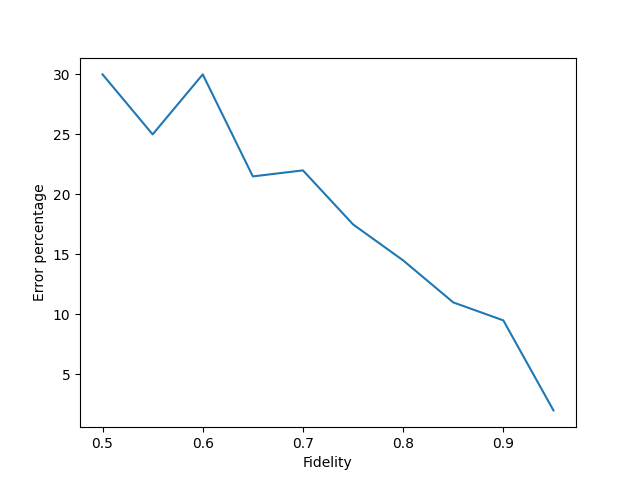

.. _label_network_configuration:

************************
Network configuration
************************
In this section the network configuration file and its options will be introduced.
We will also show how to edit and generate network configurations to do parameter sweeps.
To support the network configuration tutorial, we start with a brief introduction of the YAML language.

YAML
=======
YAML is a human-readable data-serialization language.
It performs a similar function to XML and JSON.
The main difference is that YAML relies more on indentation for nesting,
thus using significantly less special characters and improving human readability.

We use the examples ``examples/tutorial/4.1_YAML`` for the YAML introduction.
It contains two YAML files and a python file to import the YAML files and print the imports.
The first YAML example shows the basics of YAML:

.. literalinclude:: ../../../examples/tutorial/4.1_YAML/basic_example.yaml
    :language: yaml
    :caption: examples/tutorial/4.1_YAML/basic_example.yaml

The YAML files translate directly into python.
By using statements of the form: ``key: value``, a python dictionary is created containing this key and value.
By using indents after a key, such as with ``settings:`` in the example, a nested dictionary is created.
It is also possible to create list instead of dictionaries, this is done by using the syntax: ``- value``.

Using simple python script we can load the YAML files and print the contents of the file as interpreted by python.

.. literalinclude:: ../../../examples/tutorial/4.1_YAML/run.py
    :language: python
    :caption: examples/tutorial/4.1_YAML/run.py

.. code-block:: text
    :caption: Output of pprint of basic example

    {'famous-scientists': ['Albert Einstein',
                           'Isaac Newton',
                           'Marie Curie',
                           'Enrico Fermi'],
     'intro-text': 'Hello world',
     'pi': 3.14,
     'settings': {'alpha': 2.56, 'beta': 78.2}}

We observe that the contents are a python dictionary with the ``settings`` key referring to a nested dictionary
and the ``famous-scientists`` key referring a nested list.

A more common example of a YAML file would use multiple levels and a mix of lists and dictionaries:

.. literalinclude:: ../../../examples/tutorial/4.1_YAML/advanced_example.yaml
    :language: yaml
    :caption: examples/tutorial/4.1_YAML/advanced_example.yaml

.. code-block:: text
    :caption: Output of pprint of advanced example

    {'bob-owner': {'address': 'Fermi street 10', 'name': 'Bob'},
     'cars': [{'condition': {'state': 'good', 'vehicle-kilometers': 20000},
               'owner': {'address': 'Fermi street 10', 'name': 'Bob'},
               'type': 'Audi'},
              {'condition': {'state': 'bad', 'vehicle-kilometers': 500},
               'owner': {'address': 'Fermi street 10', 'name': 'Bob'},
               'type': 'Porsche'}]}

This example is focused on listing car objects, with associated information.
By using the minus sign, a list of cars has been created.
Each car has properties that define it, like condition, owner and type.
Some of these properties, like condition, are in turn nested dictionaries.

One of the useful features of YAML, that will be used in the configuration files, is to copy and paste items.
This was done in this example with the ``bob-owner`` dictionary.
The ``bob-owner`` object is used to copy the name and address to the ``owner`` property of the cars.
By using placing the following statement ``&bob`` after an item, we have created an anchor with the tag: bob.
By using the statement ``<<: *bob``  we will copy and paste the values from that anchor.
This is useful to avoid duplication.

More advanced tutorials for YAML can be found easily online.

.. _label_configuration_file:

Configuration file
===================

In this section we will explain the configuration file.
We start with the simplest configuration file, one without any noise:

.. literalinclude:: ../../../examples/tutorial/4.2_network-configuration/1_perfect.yaml
    :language: yaml
    :caption: examples/tutorial/4.2_network-configuration/1_perfect.yaml

The network requires two types of objects to be specified: stacks and links.

Stacks are the end nodes of the network and run applications.
Each stack requires a name, this name will be used by the links and applications for reference.
The ``qdevice_typ`` field requires a string that will define the type of model used for the node.
The ``qdevice_cfg`` is where the various settings for the model can be defined.
The various stack types are discussed in :ref:`label_stack_types`.

Links connect the stacks with a way of generating EPR pairs between the two nodes.
A link requires references to the two stacks it is to connect.
This is done by registering the names of the stacks in the fields ``stack1`` and ``stack2``.
The model type of the link is specified using the ``typ`` field.
The various settings for the model are defined inside ``cfg``.

.. _label_stack_types:

Stack types
++++++++++++

Generic qdevice
-----------------------
The generic quantum device is an idealized model.
It has models of noise, but lacks any peculiarities, such as certain operations and qubits experiencing more noise,
that are found in most physical systems.

The generic qdevice has two broad sources of noise: decoherence over time and depolarisation due to gate operations.

The decoherence over time is modeled using ``T1``, a energy or longitudinal  relaxation time,
and ``T2``, a dephasing or transverse relaxation time.
This noise is influenced by the time a qubit is kept in memory.
The gate execution times ``init_time``, ``single_qubit_gate_time``, ``two_qubit_gate_time`` and ``measure_time``
contribute to this noise.
The ``init_time`` determines the time required for initializing a qubit.
All times are in nano seconds.

The gate operations noise is modeled using randomly applied pauli gates.
The ``single_qubit_gate_depolar_prob`` and ``two_qubit_gate_depolar_prob``
control the chance that a random pauli gate is applied to the one or two qubits involved in the operation.

.. literalinclude:: ../../../examples/tutorial/4.2_network-configuration/2_generic_qdevice.yaml
    :language: yaml
    :caption: examples/tutorial/4.2_network-configuration/2_generic_qdevice.yaml

.. note::
    Depending on the NetSquid formalism slightly different noise models may be used.
    This originates from restrictions in using formalisms that scale better,
    but have more restrictions in what kind of quantum states may be described.

NV qdevice
-------------------------------
The nitrogen-vacancy(NV) features a more advanced model.
It describes a model with one electron qubit and one or more carbon qubits,
with a topology that forbids direct carbon to carbon interactions.

Moreover the model has less native gates than the generic qdevice.
For example, it does not have native Hadamard gates and qubit measurements can only be made on the electron qubit.

These effects do not demand different program code,
so one is allowed to use a Hadamard gate and measure all qubits in the application code,
but will cause differences in the simulation, as for example the absence of a native Hadamard gate,
will result in the Hadamard being performed using two XY or YZ rotation gates.
This in turn will apply gate depolarisation noise twice instead of once.

The NV qdevice always has one electron qubit and by increasing ``num_qubits`` multiple carbon qubits can be used.
All noise except for decoherence over time is modeled using application of a random pauli matrices.
``electron_init_depolar_prob`` and ``carbon_init_depolar_prob`` determine the chance of noise during qubit initialization.
``electron_single_qubit_depolar_prob`` and ``carbon_z_rot_depolar_prob`` control the chance of noise for single qubit operations.
``ec_gate_depolar_prob`` determines the noise chance for any operations between the electron and a carbon qubit.
``prob_error_0`` and ``prob_error_1`` simulate measurement errors using the electron.
``prob_error_0`` is the chance that instead of measuring a 0, a 1 is measured instead, ``prob_error_1`` is the reverse.

The various gate execution times function similar to the generic qdevice, but there is more specification possible.

.. literalinclude:: ../../../examples/tutorial/4.2_network-configuration/3_nv_qdevice.yaml
    :language: yaml
    :caption: examples/tutorial/4.2_network-configuration/3_nv_qdevice.yaml

.. note::
    The decoherence models, using ``T1`` and ``T2`` are only applied to qubits that are idle in memory.
    When a qubit is participating in an active operation, such as initialization, a gate or a measurement,
    it is not subject to the decoherence model that is specified via ``T1`` and ``T2``.
    The decoherence as well as all other noise sources during the operation
    are described via the noise parameter for these operations.

Link types
+++++++++++

Depolarise link
----------------
The depolarise link is a simple link model that simulates EPR pairs being generated with some noise.
The noise in the resulting EPR pairs,
is simulated via the ``fidelity`` parameter it controls how well entangled the successfully generated EPR pairs are.
The ``t_cycle`` controls how long the EPR generation takes, in nanoseconds, for a single attempt.
``prob_success`` controls the likelihood of each attempt succeeding.

.. literalinclude:: ../../../examples/tutorial/4.2_network-configuration/4_depolarise_link.yaml
    :language: yaml
    :caption: examples/tutorial/4.2_network-configuration/4_depolarise_link.yaml

Heralded link
--------------
The heralded link uses a model with both nodes connected by fiber to a midpoint station with a Bell-state measurement detector.
The nodes repeatedly send out entangled photons and, on a successful measurement at the midpoint,
the midpoint station will send out a signal to both nodes, heralding successful entanglement.
The heralded link uses the double click model as developed and described by this  `paper <https://arxiv.org/abs/2207.10579>`_.

.. literalinclude:: ../../../examples/tutorial/4.2_network-configuration/5_heralded_link.yaml
    :language: yaml
    :caption: examples/tutorial/4.2_network-configuration/5_heralded_link.yaml

Parameter sweeping
=====================
Often it will be desired to simulate not a single network configuration, but a range of parameters.
In this section we will show how to modify an existing network configuration inside ``run_simulation.py``
and how to import components of the network in order to support this modification.

In following example, we have a setup that is comparable to the earlier examples of ``examples/tutorial/3.1_output``.
The application will generate EPR pairs and measure them after a Hadamard gate.
Our goal is to use ``run_simulation.py`` to modify the network of ``config.yaml``,
replace its link with a depolarize link, perform multiple simulations with varying fidelity for the link
and generate an graph of the fidelity vs error rate.

.. literalinclude:: ../../../examples/tutorial/4.3_parameter-sweeping/run_simulation.py
    :language: python
    :caption: examples/tutorial/4.3_parameter-sweeping/run_simulation.py
    :emphasize-lines: 12-20, 26-27

We still start with loading the original configuration:

.. code-block:: python

    cfg = StackNetworkConfig.from_file("config.yaml")

We then load in the configuration options for the depolarise link:

.. code-block:: python

    depolarise_config = DepolariseLinkConfig.from_file("depolarise_link_config.yaml")

This creates the ``DepolariseLinkConfig`` object based on the parameters in the file ``depolarise_link_config.yaml``:

.. literalinclude:: ../../../examples/tutorial/4.3_parameter-sweeping/depolarise_link_config.yaml
    :language: yaml
    :caption: examples/tutorial/4.3_parameter-sweeping/depolarise_link_config.yaml

.. note::
    It is possible to create the ``DepolariseLinkConfig`` using:
    ``DepolariseLinkConfig(fidelity=0.9, t_cycle=10., prob_success=0.8)``.
    Nonetheless, it is advisable to store configurations in YAML files.

Afterwards a complete link object can be created with a depolarise model.
This link object is used to replace the original links inside the configuration:

.. code-block:: python

    link = LinkConfig(stack1="Alice", stack2="Bob", typ="depolarise", cfg=depolarise_config)

    # Replace link from YAML file with new depolarise link
    cfg.links = [link]

Running the simulation will result in a basic graph inside the image with the name:
``output_error_vs_fid.png`` being generated that looks similar to:

