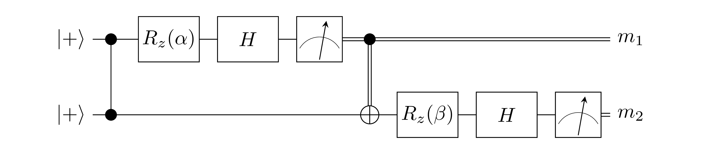
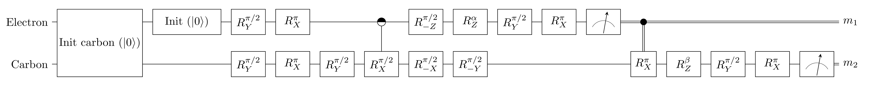

# BQC 5.1

### Effective Computation (EC)
Effective Computation (**EC**): `H Rz[beta] H Rz[alpha] |+>` followed by a measurement in the Z-basis.

### MBQC implementation of EC

### Inputs
- `alpha`: parameter of EC
- `beta`: parameter of EC

### Expected measurement outcomes
- `m1`: uniformly random
- `m2`: outcome of **EC**. Expected statistics depend on alpha and beta.

### NV implementations of MBQC

