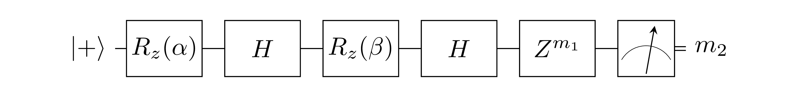
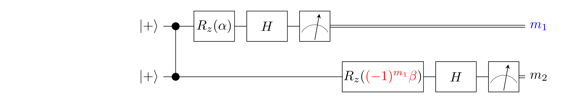
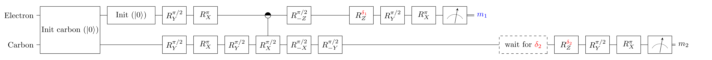

# BQC 5.2

### Effective Computation
`EC = H Rz[beta] H Rz[alpha] |+>` followed by a measurement in the Z-basis.

### MBQC implementation of EC

    - *(Exact prepared state)*: `Z^(m1) H Rz[beta] H Rz[alpha] |+>`

Blue values are sent from server to client.
Red values are sent from client to server.

The server executes the MBQC circuit.
The client computes `(-1)^m1 * beta`.

### Inputs
- `alpha`: parameter of EC
- `beta`: parameter of EC

### Expected measurement outcomes
- `m1`: uniformly random
- `m2`: outcome of **EC**. Expected statistics depend on alpha and beta.

### NV implementations of MBQC

