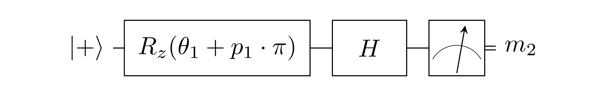
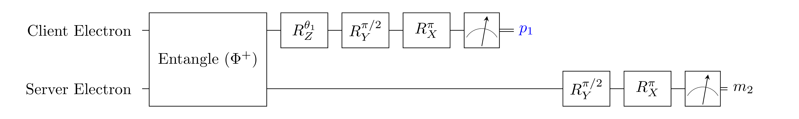

## 5.3
### Effective Computation (EC)
Effective Computation (**EC**): `H Rz[theta1 + p1 * pi] |+>` followed by a measurement in the Z-basis.

### EC implementation using Remote State Preparation (RSP)

There is no classical communication between client and server.

### Inputs
- `theta1`: parameter of EC

### Expected measurement outcomes
- `p1`: uniformly random
- `m2`: outcome of **EC**. Expected statistics depend on theta1 and p1.
    - **NOTE**: outcome is hence dependent on a value that cannot be known before running the circuit (`p1`). 
     Post-processing (flipping `m2` if `p1` is 1) can be used to let the expected outcome depend only on `theta1`.

### NV implementations
