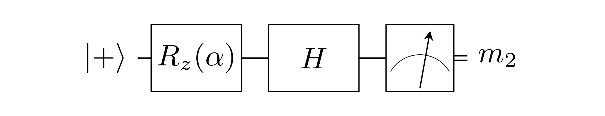
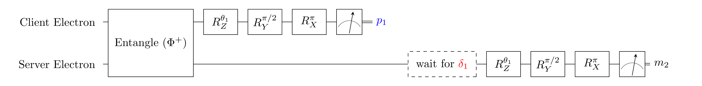

## 5.4
### Effective Computation (EC)
Effective Computation (**EC**): `H Rz[alpha] |+>` followed by a measurement in the Z-basis.

### EC implementation using Remote State Preparation (RSP)

Red values are computed by the client and sent to the server.

### Inputs
- `alpha`: parameter of EC
- `theta1`: randomly chosen by client from `[0, pi/4, ..., 7pi/4]`. Does not affect the EC.

### Expected measurement outcomes
- `p1`: uniformly random
- `m2`: outcome of **EC**. Expected statistics depend on alpha.

### NV implementations
