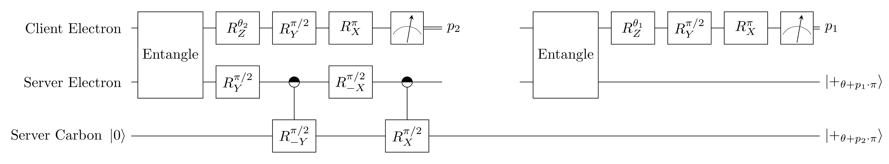
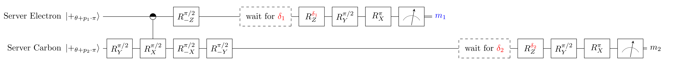

## 5.6
### Effective Computation (EC)
Effective Computation (**EC**): `H Rz[beta] H Rz[alpha] |+>` followed by a measurement in the Z-basis.
    - *(Exact prepared state)*: `Z^(m1) H Rz[beta] H Rz[alpha] |+>`

### EC implementation using RSP and MBQC

Blue values are sent from server to client.
Red values are computed by the client and sent to the server.

### Inputs
- `alpha`: parameter of EC
- `beta`: parameter of EC
- `theta1`: randomly chosen by client from `[0, pi/4, ..., 7pi/4]`. Does not affect the EC.
- `theta2`: randomly chosen by client from `[0, pi/4, ..., 7pi/4]`. Does not affect the EC.

### Expected measurement outcomes
- `p1`: uniformly random
- `p2`: uniformly random
- `m1`: uniformly random
- `m2`: outcome of **EC**. Expected statistics depend on alpha and beta.

### NV implementations

